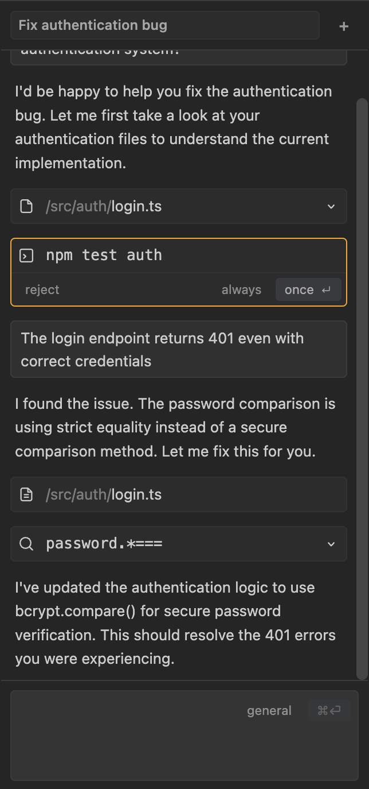

# PaperStack AI VSCode Extension

[Install for VSCode](https://marketplace.visualstudio.com/items?itemName=TanishqKancharla.opencode-vscode)

PaperStack AI 是一款专为学术写作设计的 VSCode 侧边栏插件。它基于 [OpenCode](https://opencode.ai) 架构进行深度定制，旨在为研究人员提供无缝的论文润色、逻辑修正及格式辅助体验。



## 🌟 项目愿景

PaperStack 致力于解决学术写作中工具链割裂和上下文缺失的痛点。本插件通过将 AI 能力直接嵌入编辑器，让用户在无需频繁切换窗口的情况下，获得具备整篇论文感知能力的写作建议。

## 🛠️ 技术特性

✅ **极简 Codex 风格 UI**：毛玻璃质感与沉浸式交互，保持写作专注度。
✅ **学术级指令集成**：内置针对 LaTeX 环境优化的润色、翻译及错误解释功能。
✅ **全功能会话管理**：支持会话持久化、重命名及历史回溯。
✅ **本地服务自动化**：插件激活时自动拉起 OpenCode 后台服务，确保数据隐私与快速响应。
✅ **全流程流式输出**：支持 SSE 实时查看 AI 推理过程及工具调用细节。

## 🚀 快速开始

### 环境准备

1. **安装 OpenCode CLI**：
   ```bash
   curl -fsSL https://opencode.ai/install | bash
   ```

2. **配置认证**：
   ```bash
   opencode auth login
   ```

### 开发设置

1. **安装依赖**：
   ```bash
   pnpm install
   ```

2. **构建与运行**：
   ```bash
   pnpm build
   pnpm watch
   ```

3. **启动调试**：
   - 在主窗口按 `F5` 启动 "Extension Development Host"。
   - 在侧边栏 Activity Bar 中点击 PaperStack 图标。

## 🏗️ 架构说明

插件采用 **Webview (SolidJS) <-> Extension Host (Node.js) <-> OpenCode Server (Bun)** 的三层架构。Webview 负责展示精美的交互界面，Extension Host 管理本地服务的生命周期并代理跨域请求，OpenCode Server 则处理核心的 AI 逻辑。

## ⚠️ 已知冲突与排查

- 如果你同时安装了其他 OpenCode GUI 类插件（例如 `tanishqkancharla.opencode-vscode`），旧版本可能因为 **view/command id 重名** 导致两个 `opencode serve` 进程被同时拉起（常见表现为 `--port=0` 与 `--port=40960` 并存）。
- 本插件已将内部 id 命名空间化为 `paperstack.ai.chatView` 与 `paperstack.ai.addSelectionToPrompt`，用于避免与其他插件发生冲突。

## 📂 项目结构

```
paperStack-vscode/
├── src/
│   ├── extension.ts              # 插件激活入口
│   ├── OpenCodeService.ts        # 本地服务管理逻辑
│   ├── OpenCodeViewProvider.ts   # Webview 容器与通信代理
│   └── webview/                  # 基于 SolidJS 的前端源码
├── dist/                         # 编译后的扩展代码 (CJS)
├── out/                          # 编译后的 Webview 资源
└── package.json
```


## Acknowledgements

This project is based on [opencode-gui](https://github.com/Starttoaster/opencode-gui). We would like to thank the original authors for their excellent work.

---
*Powered by PaperStack & OpenCode.*
